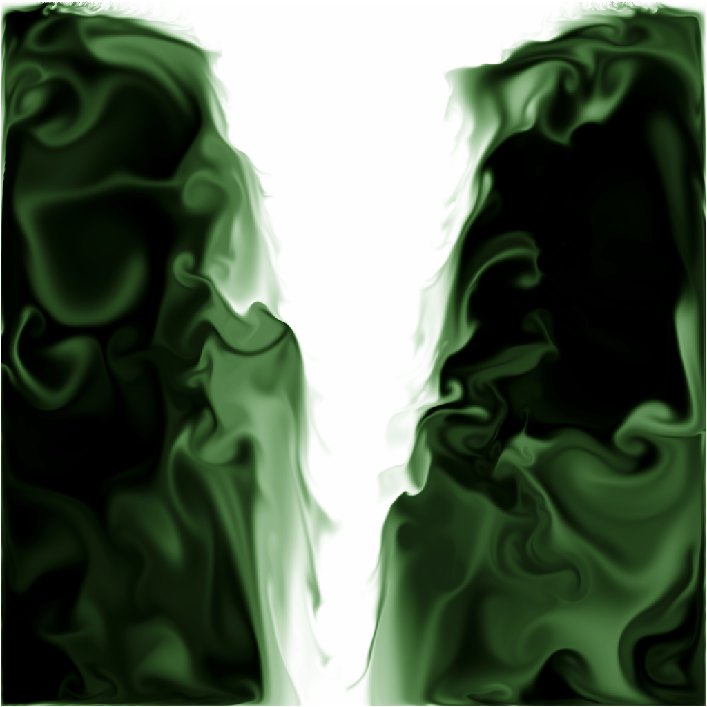

some implementations of the jos stam ["Real-Time Fluid Dynamics for Games"](https://www.dgp.toronto.edu/public_user/stam/reality/Research/pub.html) paper in js

## 2d-webgl

2d, meant to compute gpu side and render with webgl

## 2d-canvas

2d, computes cpu side, renders with canvas

